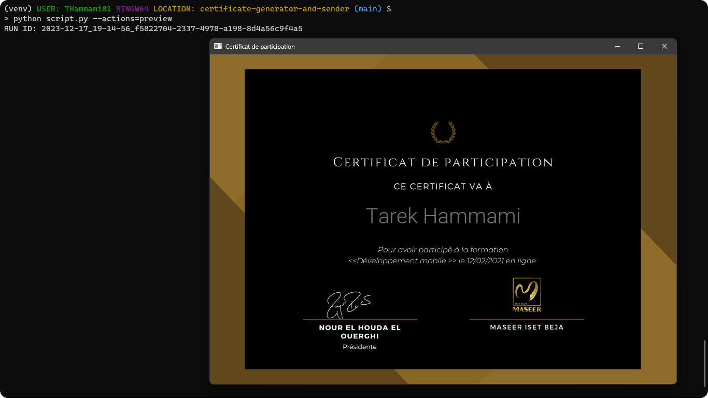
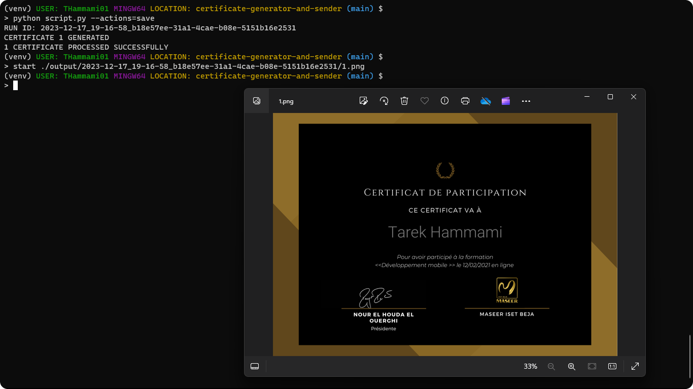
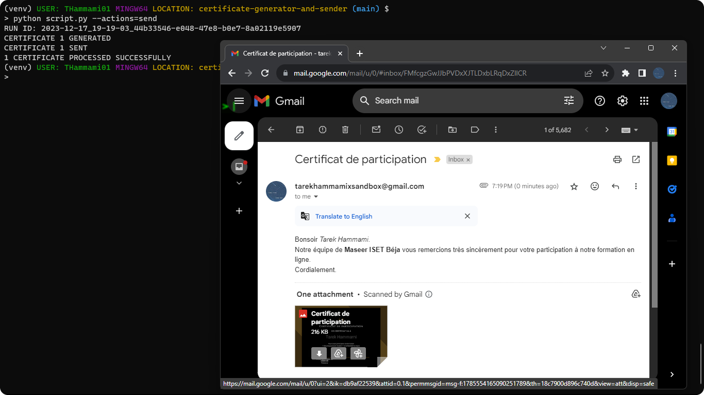

# Certificate Generator and Sender

## About

A command-line interface (CLI) tool developed to automate the complete workflow of generating certificates and sending them through personalized emails. Whether you're organizing an event or a workshop, this program offers an easy solution for automating the tasks related to certificate creation and online delivery.

## Setup

```bash
# SET UP A VIRTUAL ENVIRONMENT
> python -m venv venv

# ACTIVATE THE VIRTUAL ENVIRONMENT
> source venv/Scripts/activate

# INSTALL THE DEPENDENCIES
(venv)> pip install -r requirements.txt
# ALTERNATIVELY, YOU CAN INSTALL THEM MANUALLY: pip install opencv-python pillow

# RUN THE SCRIPT
(venv)> python script.py

# ONCE FINISHED, DEACTIVATE THE VIRTUAL ENVIRONMENT
(venv)> deactivate
```

## Command Line Help

```bash
# LIKE MOST CLI TOOLS, THIS PROGRAM SUPPORTS THE HELP COMMAND
(venv)> python script.py --help
usage: script.py [-h] [-a ACTIONS] [-c]

Certificate Generator and Sender

options:
  -h, --help            show this help message and exit
  -a ACTIONS, --actions ACTIONS
                        comma-separated list of actions to perform (preview, save, send),
                        at least one of preview or save must be selected (save is the default action),
                        example usage: --actions=save,send
  -c, --clear-run-output
                        delete the 'output/<run-id>' generated directory if send action was used,
                        example usage: --clear-run-output
```

## Use Your Data

To tailor the certificate generation and email sending to your needs, you can modify the following files:

- `attendees.csv`:
  This file contains lines in the format "fullname","email".<br>
  It can be easily exported from a Google Form.

- `data.json`:
  This file contains the template and email settings. Customize it as follows:

```json
{
  "template": {
    "filename": "<str:name>.<png|jpg|jpeg>",
    "styles": {
      "font-filename": "<str:name>.<ttf>",
      "size": <int:size>,
      "fill-color": "<str:hex-color>",
      "top-coordinate": <int:top-coordinate>
    }
  },
  "email": {
    "sender-credentials": {
      "email": "<str:email>",
      "password": "<str:password>"
      "smtp-host": "<str:smtp-host>",
      "smtp-port": <int:smtp-port>
    },
    "subject": "<str:subject>",
    "body": "<str:body>",
    "attached-certificate-filename": "<str:attached-certificate-filename>"
  }
}
```

Note that:

- Certificate templates are required to be located in the `./templates/` directory, and fonts in `./fonts/`.
- Only PNG and JPG/JPEG file formats for templates were tested, as well as TrueType Font (TTF) fonts, that explains my explicit preference for only accepting these formats.
- The `template.styles.font-filename` parameter is optional and will default to FreeMono if not specified.
- The `template.sender-credentials.smtp-host` and `template.sender-credentials.smtp-port` parameters are optional and will default to `"smtp.gmail.com"` and `465` respectively if not specified.
- For programmatic email sending using a Gmail account, consider using [App Passwords](https://support.google.com/mail/answer/185833?hl=en).<br/>
  Simply put the generated password in the `data.json` file.

## Demo

- Preview `actions` arg option:



- Save `actions` arg option:



- Send `actions` arg option:


